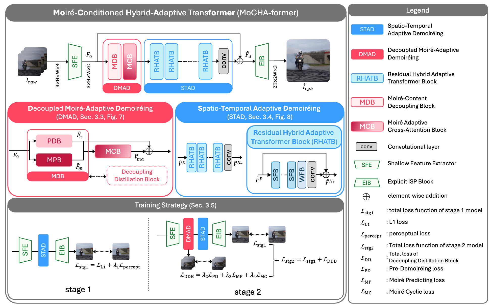

<!-- # MoCHA-former:  -->

# \[Neurocomputing'26\] ☕️ MoCHA-former: Moiré-Conditioned Hybrid Adaptive Transformer for Video Demoiréing

**[Jeahun Sung](https://cmlab.cau.ac.kr/)<sup>1</sup>, [Changhyun Roh](https://cmlab.cau.ac.kr/)<sup>1</sup>, [Chanho Eom](https://pailab.cau.ac.kr/)<sup>2</sup>, [Jihyong Oh](https://cmlab.cau.ac.kr/)<sup>1†</sup>**
<br>
<br>
<sup>1</sup>Department of Imaging Science, Graduate School of Advanced Imaging Science, Multimedia & Film, Chung-Ang University,
<br>
<sup>2</sup>Department of Metaverse Convergence, Graduate School of Advanced Imaging Science, Multimedia & Film, Chung-Ang University,
<br>
†Corresponding authors

<!-- Jeahun Sung a*, Changhyun Roh a, Chanho Eom b, Jihyong Oha,∗ -->
<!-- [](https://arxiv.org/pdf/2508.14423) -->

[](https://cmlab-korea.github.io/MoCHA-former/)
[](https://www.sciencedirect.com/science/article/pii/S0925231225031492?via%3Dihub)
[](https://arxiv.org/pdf/2508.14423)
[](https://www.youtube.com/watch?v=t01uFUSa-uI)
[](https://github.com/CMLab-Korea/MoCHA-former-arXiv)

This repository is the official PyTorch implementation of "MoCHA-former: Moiré-Conditioned Hybrid Adaptive Transformer for Video Demoiréing".



## 📧 News
* **on Dec 26, 2025**: Full code published
* **on Dec 26, 2025**: Published in **Neurocomputing** with open access
* **on Aug 24, 2025**: This repository is created

## 📝 TODO
- [ ] checkpoint upload
- [ ] modifying main framework figure to final version of our paper


## 📚 Version Info

* basicsr==1.4.2
* scikit-image==0.15.0
* deepspeed

## ⚙️ Environment Setting

We provide two types of environments: a Conda environment and a Docker-based environment.

### 🐍 Using Conda
```
conda env export -n RRID environments.yml
```

### 🐳 Using Docker
1. downloading docker image
```
docker pull jeahun00/rrvd:latest
```

2. executing docker container 
```
docker container run -it -d --gpus all --shm-size=128G -v {local_server_path}:/code --name demoire jeahun00/rrvd:latest /bin/bash
```

3. enter docker container
```
docker exec -it demoire /bin/bash
```

4. activating anaconda environment
When using Docker, one can utilize RRID within the Conda environment inside the container.
```
conda activate RRID
```

## 📁 Prepare Dataset

* [RawVDemoire full dataset link](https://github.com/tju-chengyijia/VD_raw)


<!-- /home/jeahun/demoire_ai/options/test/demoire_ai_01.yml -->
## 🚀 Get Started

* You must adjust `dataroot_gt` and `dataroot_lq` in each corresponding YAML file for both training and testing to match the paths of your own dataset.
* The checkpoint trained in Stage 1 is stored in `experiments/{exp_stage1_name}/model`.
* You only need to specify this checkpoint path in `options/train/MoCHA-former_stg2.yml` under `path → pretrain_network_g`.


### Training
* We adopt a two-stage training strategy in the proposed MoCHA-former.

* **stage 1** training
```
PYTHONPATH="./:${PYTHONPATH}" CUDA_VISIBLE_DEVICES=0 python train.py -opt options/train/MoCHA-former_stg1.yml
```
* **stage 2** training
```
PYTHONPATH="./:${PYTHONPATH}" CUDA_VISIBLE_DEVICES=0 python train.py -opt options/train/MoCHA-former_stg2.yml
```

### Testing

```
PYTHONPATH="./:${PYTHONPATH}" CUDA_VISIBLE_DEVICES=0 python test.py -opt options/test/demoire_ai_01.yml
```

### Get Qualitative & Quantitative Result

* The quantitative evaluation results are saved to `./result/{experiment name}/test_{experiment name}_{executing date}.log` when the test command is executed.
* The quantitative evaluation results are automatically executed for all experiments.

* The qualitative evaluation results are stored in `./result/{experiment name}/visualization.`
* The qualitative evaluation results can be obtained by setting save_img to true in the `./options/test/{experiment name}.yml` file, as shown below.

```yml
...
# validation settings
val:
  save_img: true
  metrics:
    psnr:
      type: calculate_vd_psnr
    ssim:
      type: calculate_vd_ssim
    lpips:
      type: calculate_vd_lpips

```


## ✨ Results
Please visit our [project page](https://cmlab-korea.github.io/MoCHA-former/) and [demo video](https://www.youtube.com/watch?v=t01uFUSa-uI)

* Demo Video

<div align="center">
  <a href="https://www.youtube.com/watch?v=t01uFUSa-uI">
    
  </a>
</div>
